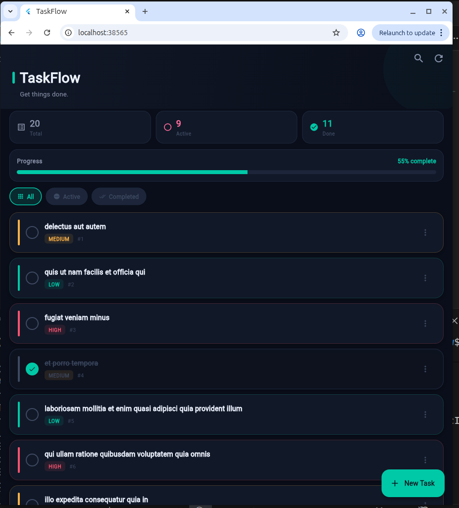
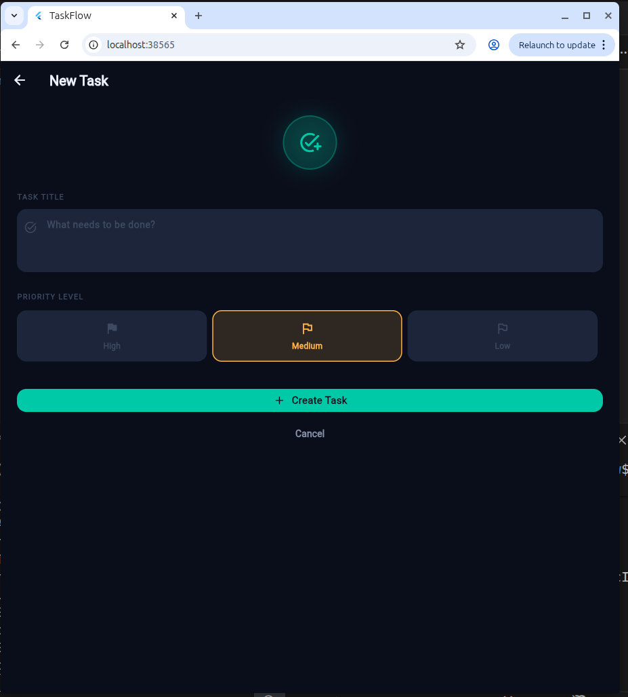
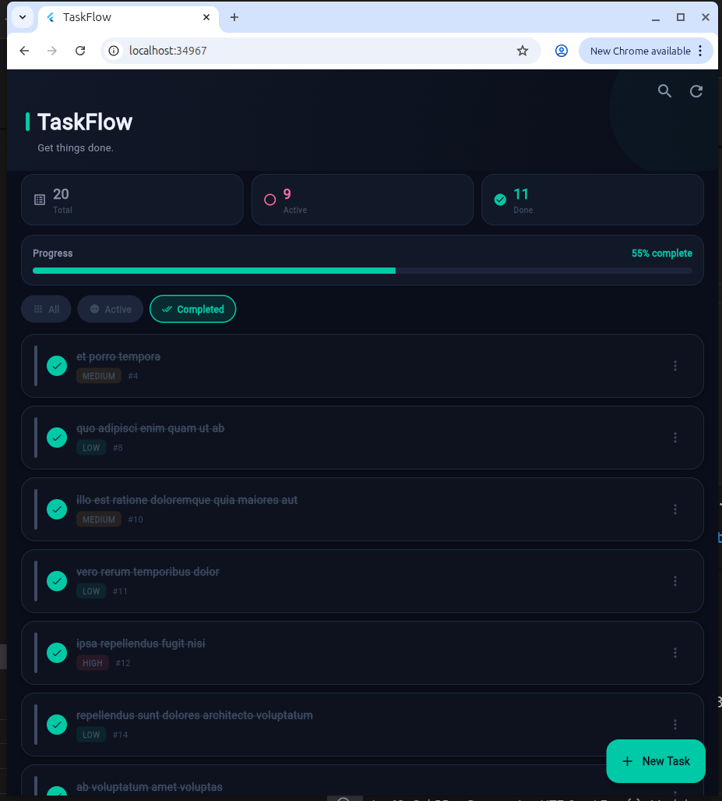

# TaskFlow ✅

A beautiful Flutter CRUD application using **Provider** state management and the **http** package, powered by the [JSONPlaceholder API](https://jsonplaceholder.typicode.com).

---

## ✨ Features

- ✅ **Create** — Add new tasks with title and priority level (High / Medium / Low)
- 📋 **Read** — Fetch tasks from JSONPlaceholder API with pagination (infinite scroll)
- ✏️ **Update** — Edit task title, priority, and toggle completion status
- 🗑️ **Delete** — Remove tasks with swipe-to-dismiss or menu option
- 🔍 **Search** — Real-time search through your task list
- 📊 **Stats Header** — Live count of total / active / completed tasks + progress bar
- 🎯 **Filter** — View All, Active, or Completed tasks
- ⚡ **Optimistic Updates** — Toggle completes instantly, reverts on failure
- 🚨 **Error Handling** — Network errors, timeouts, and server errors handled gracefully
- 💫 **Loading States** — Per-action loading indicators

---

## 🛠 Tech Stack

| Layer | Technology |
|-------|-----------|
| State Management | Provider 6.x |
| Networking | http 1.x |
| API | JSONPlaceholder |
| UI | Flutter + Material 3 |
| Architecture | Repository Pattern |

---

## 📁 Project Structure

```
lib/
├── core/
│   ├── constants/       # API endpoints
│   ├── services/        # HTTP client wrapper + error handling
│   └── theme/           # Colors, typography, theme
├── data/
│   ├── models/          # TodoModel
│   └── repositories/    # TodoRepository (CRUD methods)
├── presentation/
│   ├── providers/       # TodoProvider (ChangeNotifier)
│   ├── pages/           # HomePage, AddEditPage
│   └── widgets/         # TodoCard, StatsHeader, FilterChips, etc.
└── main.dart
```

---

## 🚀 Getting Started

```bash
git clone https://github.com/your-username/taskflow.git
cd taskflow
flutter pub get
flutter run
```

---

## 📸 Screenshots

## Home Screen
 

## Add Task 
  

## Edit Task 
 

---

## 🔗 API Reference

Uses [JSONPlaceholder](https://jsonplaceholder.typicode.com/todos) — a free public REST API.

| Action | Method | Endpoint |
|--------|--------|----------|
| Fetch todos | GET | `/todos?_limit=20&_start=0` |
| Fetch one | GET | `/todos/:id` |
| Create | POST | `/todos` |
| Update | PUT | `/todos/:id` |
| Delete | DELETE | `/todos/:id` |